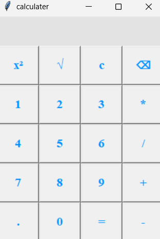

# Calculator

A simple calculator application built with Python and Tkinter.

This calculator supports basic arithmetic operations, square root, power calculations, decimal numbers, and editing features such as clear and backspace.

## Features

- Addition
- Subtraction
- Multiplication
- Division
- Square root calculation
- Power calculation
- Decimal number support
- Clear current expression
- Backspace functionality

## Technologies Used

- Python
- Tkinter (GUI)

## Screenshot

